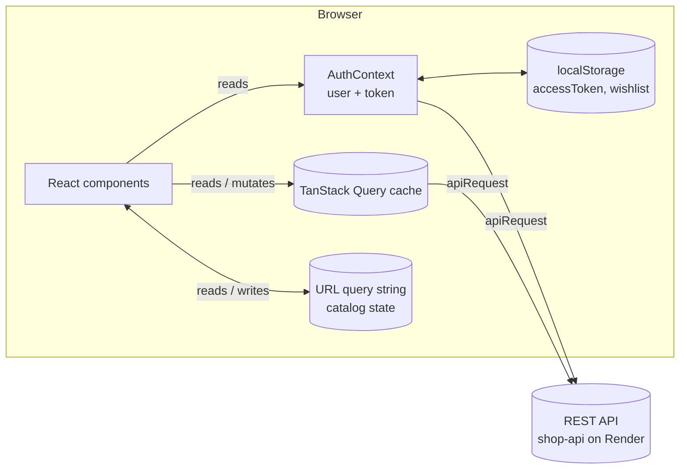
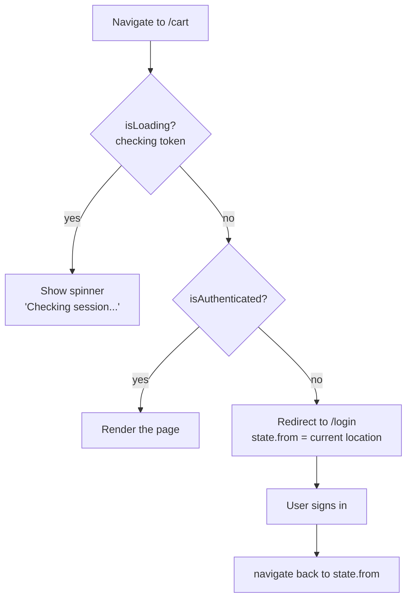
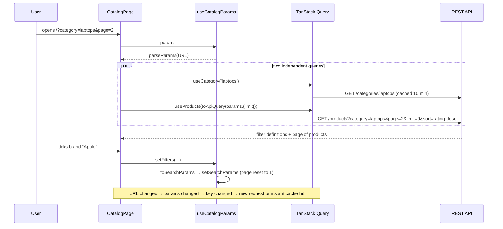
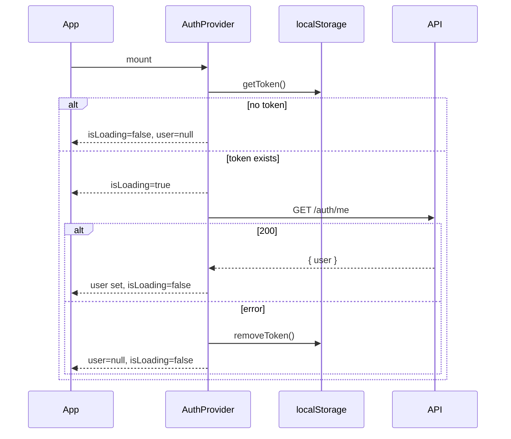
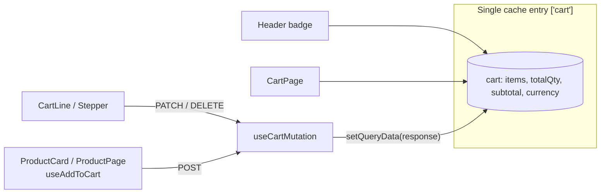
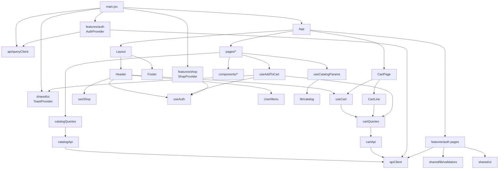

# Architecture — Cyber Shop

This document explains how the Cyber Shop front end is built: where every piece of code lives, how data moves through the app, what each module and function is responsible for, and the reasoning behind the main design decisions. It is written so that a new developer can open any file and immediately understand *what it does*, *who calls it* and *what it depends on*.

> Scope: this repository contains the **front end only** (a single-page application). The back end is a separate, ready-made REST API (`https://shop-api-kbe6.onrender.com/api`).

---

## Table of contents

1. [Big picture](#1-big-picture)
2. [Tech stack and tooling](#2-tech-stack-and-tooling)
3. [Folder structure](#3-folder-structure)
4. [Application bootstrap](#4-application-bootstrap)
5. [Routing](#5-routing)
6. [State management model](#6-state-management-model)
7. [Networking layer](#7-networking-layer)
8. [Catalog module](#8-catalog-module)
9. [Product page](#9-product-page)
10. [Authentication module](#10-authentication-module)
11. [Cart module](#11-cart-module)
12. [Wishlist module](#12-wishlist-module)
13. [Shared UI kit](#13-shared-ui-kit)
14. [Layout components](#14-layout-components)
15. [Styling system](#15-styling-system)
16. [Error handling strategy](#16-error-handling-strategy)
17. [Accessibility notes](#17-accessibility-notes)
18. [Performance notes](#18-performance-notes)
19. [API reference (as used by the front end)](#19-api-reference-as-used-by-the-front-end)
20. [Dependency graph between modules](#20-dependency-graph-between-modules)
21. [How to extend the project](#21-how-to-extend-the-project)
22. [Known limitations and technical debt](#22-known-limitations-and-technical-debt)
23. [Glossary](#23-glossary)

---

## 1. Big picture

Cyber Shop is an online electronics store. A visitor can browse a category, filter, sort and search products, open a product page, register / sign in, add products to a **server-side cart**, and edit their profile. Checkout, the wishlist page and the About / Contact / Blog pages are placeholders.



The key architectural idea is a **strict split of state by origin**:

| Kind of state | Where it lives | Why |
| --- | --- | --- |
| Server data (products, categories, cart) | TanStack Query cache | Caching, deduplication, loading / error states, background refetch come for free |
| Who is signed in | `AuthContext` (+ token in `localStorage`) | It is client state that many components need |
| Catalog filters, sort, page, search | The URL query string | Shareable links, working Back button, state survives refresh |
| Wishlist | `ShopContext` (+ `localStorage`) | The API has no wishlist endpoints yet |
| Purely visual state (open dropdown, selected photo) | Local `useState` inside the component | Nobody else needs it |

---

## 2. Tech stack and tooling

| Area | Technology | Notes |
| --- | --- | --- |
| UI | React 19 | Function components and hooks only. `ref` is passed as a normal prop (React 19), see `Input` / `PasswordInput`. |
| Build | Vite 8 | Dev server and production bundler. |
| Optimisation | React Compiler (`babel-plugin-react-compiler` via `@rolldown/plugin-babel`) | Automatic memoisation; that is why the code has very few `useMemo` / `useCallback` calls. |
| Routing | React Router 7 (`react-router-dom`) | Declarative `<Routes>` with a nested layout route. |
| Server state | TanStack Query 5 (+ Devtools in dev) | Single shared `QueryClient`. |
| Forms | React Hook Form 7 + `@hookform/resolvers` | Uncontrolled inputs, `register()` spread. |
| Validation | Zod 3 | All schemas in one file: `src/shared/lib/validators.js`. |
| Linting | ESLint 10 (flat config) + `react-hooks` + `react-refresh` | `npm run lint`. |
| Language | JavaScript (ES modules, JSX) | Types come from `@types/react` for editor hints only. |
| Fonts | Inter (Google Fonts, loaded in `index.html`) | |

### Build configuration (`vite.config.js`)

* Plugins: `@vitejs/plugin-react` and `@rolldown/plugin-babel` with `reactCompilerPreset()`.
* Path aliases (also used by ESLint/IDE resolution through Vite):

| Alias | Resolves to |
| --- | --- |
| `@` | `src/` |
| `@api` | `src/api/` |
| `@shared` | `src/shared/` |
| `@features` | `src/features/` |

### Environment

| Variable | Default | Purpose |
| --- | --- | --- |
| `VITE_API_URL` | `https://shop-api-kbe6.onrender.com/api` | Base URL of the REST API. The same value is hard-coded as a fallback in `apiClient.js`, so the app works without a `.env` file. |

### SPA hosting

All paths must be rewritten to `index.html`. `public/_redirects` (`/*  /index.html  200`) covers Netlify-style hosts; Render static sites need a rewrite `/*` → `/index.html`; Firebase needs `"rewrites": [{ "source": "**", "destination": "/index.html" }]`.

---

## 3. Folder structure

```
cyber-shop/
├─ index.html                 HTML shell: fonts, <div id="root">, loads /src/main.jsx
├─ vite.config.js             Vite + React Compiler + path aliases
├─ eslint.config.js           ESLint flat config
├─ package.json               scripts and dependencies
├─ .env / .env.example        VITE_API_URL
├─ public/
│  ├─ favicon.svg, icons.svg  static assets
│  └─ _redirects              SPA fallback for Netlify-style hosting
└─ src/
   ├─ main.jsx                entry point: provider stack + render
   ├─ App.jsx                 route table
   │
   ├─ api/                    SERVER-STATE LAYER for catalog and cart
   │  ├─ queryClient.js         the one shared QueryClient + defaults
   │  ├─ queryKeys.js           central registry of cache keys
   │  ├─ catalogApi.js          plain fetch functions (no React)
   │  ├─ catalogQueries.js      queryOptions + hooks (useProducts, useProduct, useCategory…)
   │  ├─ cartApi.js             plain fetch functions for the cart
   │  └─ cartQueries.js         cart query + mutation hooks
   │
   ├─ shared/                 CROSS-CUTTING building blocks, no business logic
   │  ├─ api/apiClient.js       apiRequest(), ApiError, token helpers
   │  ├─ lib/validators.js      all Zod schemas
   │  └─ ui/                    Button, Input, PasswordInput, FormField, Alert, Toast, Icons
   │
   ├─ features/               SELF-CONTAINED FEATURE MODULES
   │  ├─ auth/                  context, hooks, pages, ProtectedRoute, AuthLayout, lib
   │  ├─ cart/                  hooks, components, CartPage, lib
   │  └─ shop/                  wishlist (context + hook)
   │
   ├─ pages/                  CATALOG-SIDE PAGES
   │  ├─ CatalogPage/           product grid + filters + sort + pagination
   │  ├─ FiltersPage/           mobile filters screen
   │  ├─ ProductPage/           single product
   │  └─ StubPage/              placeholder / 404 page
   │
   ├─ components/             SHOP-SPECIFIC REUSABLE COMPONENTS
   │  ├─ Layout, Header, Footer, Logo, UserMenu
   │  ├─ ProductCard, ProductCardSkeleton, ProductImage, Stars
   │  ├─ FilterPanel, Checkbox, PriceRange, SortSelect, Pagination
   │  └─ Breadcrumbs, LoadingHint, QueryError, icons/
   │
   ├─ lib/                    PURE FUNCTIONS (no React, easy to test)
   │  ├─ catalog.js             URL ⇄ state ⇄ API query mapping
   │  ├─ format.js              formatPrice, formatWarranty
   │  ├─ specs.js               product spec labels and grouping
   │  └─ filterLabels.js        filter titles and colour swatches
   │
   ├─ hooks/                  GENERIC HOOKS
   │  ├─ useCatalogParams.js    catalog state ⇄ URL
   │  └─ useMediaQuery.js       reactive window.matchMedia
   │
   └─ styles/                 GLOBAL CSS
      ├─ vars.css               shop colour variables (--c-*)
      ├─ auth-tokens.css        auth/form design tokens (--color-*, spacing, radius…)
      ├─ reset.css              CSS reset
      └─ global.css             imports the above + base styles + utilities
```

### Conventions

* **One component = one folder** containing `Component.jsx` and `Component.css` (BEM-style class names such as `product-card__btn--disabled`).
* **Barrel files** (`index.js`) expose the public API of a feature (`@features/auth`, `@features/cart`, `@features/shop`, `@shared/ui`). Inside a feature, files import each other by relative path.
* **Layering rule (top to bottom may import, never upwards):**

```
pages / features  →  components  →  shared (ui, api, lib)  →  lib / hooks (pure)
        ↓
       api (query hooks)  →  shared/api/apiClient
```

* **Pure logic is extracted** from components into `lib/` files (`catalog.js`, `cartRules.js`, `cartErrors.js`, `profileForm.js`, `format.js`, `specs.js`) so it has no React dependency and can be unit-tested directly.
* **Plain fetch functions are separated from React hooks** (`catalogApi.js` vs `catalogQueries.js`, `cartApi.js` vs `cartQueries.js`).

---

## 4. Application bootstrap

`src/main.jsx` mounts the app and defines the **provider order**. The order matters because providers depend on each other:

```jsx
<StrictMode>
  <QueryClientProvider client={queryClient}>   // 1. server-state cache
    <ToastProvider>                            // 2. toast notifications
      <AuthProvider>                           // 3. who is signed in (uses QueryClient)
        <ShopProvider>                         // 4. wishlist (needs the user id from AuthProvider)
          <BrowserRouter>                      // 5. routing
            <App />
          </BrowserRouter>
        </ShopProvider>
      </AuthProvider>
    </ToastProvider>
    <ReactQueryDevtools initialIsOpen={false} />   // dev only (the "flower" button)
  </QueryClientProvider>
</StrictMode>
```

Why this order?

1. `QueryClientProvider` is outermost: `AuthProvider` needs `useQueryClient()` to clear the cart cache on login/logout.
2. `ToastProvider` has no dependencies, but hooks such as `useAddToCart` need `useToast()`.
3. `AuthProvider` must wrap `ShopProvider` because the wishlist is stored *per user id*.
4. `BrowserRouter` is innermost of the providers; `useShop()` and `useAddToCart()` use router hooks (`useNavigate`, `useLocation`) so they must be called under the router.

`App.jsx` then renders the route table (next section). The global stylesheet `styles/global.css` is imported once in `main.jsx`.

---

## 5. Routing

All routes are children of one layout route, so the **Header and Footer are always on screen**; only the `<Outlet />` changes.

| Path | Component | Access | Description |
| --- | --- | --- | --- |
| `/` | `CatalogPage` | public | Catalog. All state is in the query string. |
| `/filters` | `FiltersPage` | public | Mobile filters screen. On desktop it redirects to `/`. |
| `/product/:slug` | `ProductPage` | public | Product details. |
| `/login` | `LoginPage` (in `AuthLayout`) | public | Sign in. |
| `/register` | `RegisterPage` (in `AuthLayout`) | public | Create account. |
| `/forgot-password` | `ForgotPasswordPage` (in `AuthLayout`) | public | 3-step password reset. |
| `/account` | `AccountPage` | **protected** | Profile editor. |
| `/cart` | `CartPage` | **protected** | Server cart. |
| `/checkout` | `StubPage` | **protected** | Placeholder (task FE-006). |
| `/about`, `/contact`, `/blog` | `StubPage` | public | Placeholders. |
| `/wishlist` | `StubPage` | public | Placeholder; the wishlist data exists, the page does not yet. |
| `*` | `StubPage` ("Page not found") | public | 404. |

### Route structure

```
<Route element={<Layout />}>                 Header + <Outlet/> + Footer
  index                  → CatalogPage
  filters                → FiltersPage
  product/:slug          → ProductPage
  <Route element={<AuthLayout />}>           narrow centred card
     login | register | forgot-password
  </Route>
  account  → <ProtectedRoute><AccountPage/></ProtectedRoute>   (wide card, so it sits outside AuthLayout)
  cart     → <ProtectedRoute><CartPage/></ProtectedRoute>
  checkout → <ProtectedRoute><StubPage/></ProtectedRoute>
  about | contact | blog | wishlist → StubPage
  *        → StubPage (404)
</Route>
```

`Layout` also calls `window.scrollTo(0, 0)` whenever `pathname` changes, so every navigation starts at the top of the page.

### ProtectedRoute behaviour



The `isLoading` state exists so that a signed-in user who refreshes `/cart` does **not** see a flash of the login page while the token is being verified.

---

## 6. State management model

### 6.1 URL state (catalog)

`useCatalogParams()` is the **only** place that reads and writes catalog state. There is no `useState` or context for filters, sort, page or search query.

```
URL  ──parseParams──▶  params {q, sort, page, category, filters}
                              │
                              ├──toApiQuery──▶ query object ──▶ useProducts(query)  (query object = cache key)
                              └──UI reads params to render selected filters, sort, page

user changes a filter ─▶ setFilters() ─▶ toSearchParams() ─▶ setSearchParams() ─▶ URL changes ─▶ everything above re-runs
```

Example URL:

```
/?category=laptops&brand=Apple,Samsung&storage=256gb&minPrice=500&maxPrice=3000&inStock=true&sort=price-asc&page=2&q=pro
```

Rules that keep URLs clean:

* Default category (`smartphones`), default sort (`rating-desc`) and page 1 are **omitted** from the URL.
* Multiple values of one filter are comma-separated (exactly the format the API expects).
* Changing filters or sort resets `page` to 1.

### 6.2 Server state (TanStack Query)

* One `QueryClient` for the whole app (`src/api/queryClient.js`).
* **Defaults:** `staleTime` 60 s; `refetchOnWindowFocus` disabled; `retry` — never for 4xx responses (they are answers, not failures), at most 2 retries otherwise.
* **Per-query overrides:** categories and category filter definitions use `staleTime` of 10 minutes because they almost never change.
* **Query keys** are centralised in `queryKeys.js`:

| Key | Data |
| --- | --- |
| `['categories']` | list of categories |
| `['categories', slug]` | one category with its `filters` array |
| `['products', 'list', query]` | one page of products; `query` is the whole API query object |
| `['products', 'detail', slug]` | one product |
| `['cart']` | the signed-in user's whole cart |

* **`placeholderData: keepPreviousData`** on `useProducts` keeps the previous page on screen (dimmed, class `catalog__grid--stale`) while the next one loads — no spinner flash when paginating or filtering.

### 6.3 Auth state (`AuthContext`)

| Field | Type | Meaning |
| --- | --- | --- |
| `user` | object \| null | The current user from `GET /auth/me`, `/auth/login` or `/auth/register` |
| `isLoading` | boolean | `true` only during the startup session check |
| `isAuthenticated` | boolean | `!!user` |
| `login(token, user)` | function | Stores the token, sets the user, clears the previous cart cache |
| `logout()` | async function | Calls `POST /auth/logout`, always removes the token, clears user and cart cache |
| `setUser(user)` | function | Used by the profile page to publish saved changes |

Three states are possible: **loading** (token present, being verified), **authenticated**, **unauthenticated**.

### 6.4 Wishlist state (`ShopContext`)

Stored in `localStorage` under `shop:<userId>` as `{ wishlist: [productId, …] }`. See [section 12](#12-wishlist-module).

---

## 7. Networking layer

### 7.1 `apiRequest(endpoint, options)` — `src/shared/api/apiClient.js`

Every HTTP call in the app goes through this one function.

| Step | Behaviour |
| --- | --- |
| Base URL | `import.meta.env.VITE_API_URL` or the Render URL fallback |
| Token | `Authorization: Bearer <token>` is added from `localStorage` **unless** the call is made with `{ auth: false }` |
| Headers | `Content-Type: application/json` is added **only when there is a body** (so plain `GET`s avoid a CORS preflight) |
| Response | JSON is parsed when the content type is JSON; an empty body (e.g. 204) gives `{}` |
| Errors | Non-2xx responses throw an **`ApiError`** |
| Session loss | On `401` with code `TOKEN_EXPIRED` or `INVALID_TOKEN`: remove token and hard-redirect to `/login` |
| Exceptions to the redirect | `POST /auth/login`, `POST /auth/register` (a 401 there is a normal form error) and `GET /auth/me` (the startup check, handled by `AuthProvider`) |

```js
class ApiError extends Error {
  status   // HTTP status
  code     // machine-readable code, e.g. 'INSUFFICIENT_STOCK' (defaults to 'UNKNOWN_ERROR')
  errors   // field → message map for validation errors, or null
  data     // the full error body (e.g. { available: 3 } or { retryAfterSeconds: 30 })
}
```

> **Rule used throughout the code:** decide what to do from `error.code` / `error.status`, never from `error.message` (the text may change).

Token helpers: `getToken()`, `setToken(token)`, `removeToken()` — thin wrappers over `localStorage['accessToken']`.

### 7.2 Public vs. private calls

* **Catalog requests** (`catalogApi.js`) are sent with `auth: false`. An expired token can therefore never break browsing.
* **Cart requests** (`cartApi.js`) use the default (`auth: true`).

### 7.3 Request cancellation

Query functions receive `{ signal }` from TanStack Query and pass it to `fetch`, so outdated requests (the user changed a filter again) are aborted.

---

## 8. Catalog module

Files: `pages/CatalogPage`, `pages/FiltersPage`, `components/FilterPanel`, `PriceRange`, `Checkbox`, `SortSelect`, `Pagination`, `ProductCard`, `ProductCardSkeleton`, `Breadcrumbs`, `lib/catalog.js`, `lib/filterLabels.js`, `hooks/useCatalogParams.js`, `hooks/useMediaQuery.js`, `api/catalogApi.js`, `api/catalogQueries.js`.

### 8.1 Data flow of the catalog page



### 8.2 `CatalogPage` responsibilities

* Chooses the page size: **8 products on mobile, 9 on desktop** (`useMediaQuery(MOBILE_QUERY)`; mobile = `max-width: 1023px`).
* Renders the filter sidebar (desktop only), the result counter, the "Filters" button (mobile only), the sort dropdown, the product grid, the range text ("Showing 1–9 of 42") and pagination.
* Handles every state of both queries:

| Situation | What is shown |
| --- | --- |
| Category query 404 | `StubPage` "Category not found" |
| Products loading (first time) | `LoadingHint` + 8/9 `ProductCardSkeleton`s |
| Products loading (next page / new filter) | Previous grid, dimmed |
| Products error | `QueryError` with a "Try again" button (`refetch`) |
| Empty result | "No products match your filters." + "Reset filters" link |
| Page number beyond the last page | `<Navigate replace>` to the last page |
| Category filters loading / failed | Skeleton blocks / "Could not load the filters." |

* `useEffect` scrolls to top whenever `page` changes.
* The `AVAILABILITY_GROUP` ("In stock", "On sale") is **appended** to the category's own filter list on the client, because it maps to the API flags `inStock` and `onSale` and is not a category attribute.
* Sets the document title with the React 19 `<title>` element.

### 8.3 `lib/catalog.js` — the URL ⇄ state ⇄ API translator

| Export | Signature | What it does |
| --- | --- | --- |
| `DEFAULT_CATEGORY` | `'smartphones'` | Used when the URL has no `category` |
| `DEFAULT_SORT` | `'rating-desc'` | Used when `sort` is missing or invalid |
| `SORT_OPTIONS` | array | `rating-desc`, `price-asc`, `price-desc`, `newest`, `oldest`, `popular`, `title-asc` with labels |
| `AVAILABILITY_GROUP` | object | Virtual checkbox group: In stock / On sale |
| `emptyFilters()` | `() → filters` | `{ availability: [], minPrice: null, maxPrice: null }` |
| `parseParams(sp)` | `URLSearchParams → { q, sort, page, category, filters }` | Parses and **validates**: unknown sort → default; invalid page → 1; negative / non-numeric prices → `null`; ignores reserved keys and unsafe keys (regex `^[a-z][\w-]*$`); every other key becomes an attribute filter with comma-separated values |
| `toSearchParams(state)` | `→ URLSearchParams` | Inverse of `parseParams`; omits defaults |
| `toApiQuery(state, { limit })` | `→ object` | Builds the `GET /products` query; the same object is the **TanStack Query key** |
| `countActiveFilters(filters)` | `→ number` | Sum of selected values + price bounds; shown on the mobile "Filters (N)" button |

Reserved URL keys (never treated as attribute filters): `q`, `sort`, `page`, `category`, `minPrice`, `maxPrice`, `inStock`, `onSale`, `minRating`.

### 8.4 Data-driven filters — `FilterPanel`

`FilterPanel` renders whatever the API sends in `category.filters`:

```js
{ key: 'brand', label: '…', type: 'checkbox' | 'radio' | 'color' | 'range', options: [{ value, label }], min, max }
```

Nothing is hard-coded per category, so adding a category on the server needs **no front-end change**.

| Prop | Meaning |
| --- | --- |
| `groups` | array of filter definitions |
| `value` | `{ [key]: string[], minPrice, maxPrice }` |
| `onChange(nextValue)` | called with the full new filter object |
| `defaultOpen` | section keys opened initially (`['price','brand']` on desktop) |
| `withPrice` | render the price section |
| `scrollable` | give long option lists their own scroll area (mobile screen) |
| `priceDelay` | debounce for the price slider (`0` on mobile) |

Behaviour details:

* **Accordion sections** with `aria-expanded` / `aria-controls`.
* A list with **more than 6 options gets its own search box**.
* **Radio** groups hold at most one value and show an explicit "Reset" button (a radio cannot be un-ticked by clicking it again).
* **Colour** groups show a swatch from `getColorHex(value)`; unknown colours fall back to neutral grey `#cfcfcf` (the text label is always shown too).
* When the user selects the full price range, `minPrice` / `maxPrice` are set to `null` so no price filter appears in the URL or request.
* `getFilterTitle(group)` uses an English title for known keys (brand, price, storage, ram, color, os, type, material, size, gender, season, availability) and falls back to the API label (which is Georgian).

### 8.5 `PriceRange`

A dual-handle slider plus two numeric text inputs.

* While dragging, only a **local draft** changes; `onChange` fires `delay` ms (400 by default) after the last movement, so the app does not send one request per pixel.
* Typing a number and pressing **Enter** or leaving the field commits immediately (value is clamped between the bounds and the other handle).
* `delay = 0` (mobile filters screen) calls `onChange` immediately because nothing is fetched until "Apply".
* It resynchronises its draft when the parent value changes from outside (reset, Back button) using the "adjust state during render" pattern rather than an effect.

### 8.6 Mobile filters screen — `FiltersPage`

* On desktop it immediately redirects to `/` (the sidebar is used instead).
* Keeps a **draft** copy of the filters in local state. Nothing is applied until the user presses **Apply**, which writes the draft to the URL (page reset to 1) and navigates back to `/`.
* "Clear all" resets the draft; the Back arrow returns to the catalog preserving the current query string.

### 8.7 Header search

`HeaderSearch` (inside `Header`):

* Keeps its own text state, debounced by **400 ms** (`SEARCH_DELAY`) before updating `q` in the URL.
* Preserves all other query parameters, removes `page`, and always navigates to `/`.
* On the catalog page typing uses `replace` (no history spam); pressing Enter forces a normal navigation.
* If the URL's `q` changes from outside (e.g. the "Clear" link), the input text is resynchronised.

### 8.8 `Pagination`

`getPages(page, total)` returns a compact list: all pages when `total ≤ 5`; otherwise `1 2 3 … N`, `1 … N-2 N-1 N`, or `1 … p-1 p p+1 … N`. Buttons carry `aria-label="Page N"` and `aria-current="page"`. The component renders nothing when there is only one page.

---

## 9. Product page

File: `pages/ProductPage/ProductPage.jsx`.

Structure: `ProductPage` (data loading) → `ProductView` (presentation).

* `ProductPage` calls `useProduct(slug)`. Loading → `ProductSkeleton`; 404 → `StubPage` "Product not found"; other errors → `QueryError` with retry.
* `ProductView` is rendered with `key={product.id}` so navigating between related products **resets local state** (selected photo, expanded specs) automatically.

Sections:

1. **Breadcrumbs** — Home › Catalog › Category › Brand › Title (category and brand links point back to the filtered catalog).
2. **Gallery** — thumbnails (if more than one image) + main photo via `ProductImage`.
3. **Info block** — title, price (with old price and `-N%` badge), colour swatch, storage chip, six **quick specs** with icons, wishlist toggle, **Add to Cart** button (disabled when out of stock or while adding), and three perk tiles (delivery, stock count, warranty).
4. **Details** — description and spec tables. `buildSpecGroups()` produces `{ main, more }`: the first two groups are always visible, the rest are behind a **View More / View Less** toggle.
5. **Reviews** — only the real rating and review count (the API has no reviews endpoint, so no fake reviews are shown).
6. **Related products** — up to 8 `ProductCard`s from `product.related`.

### `lib/specs.js`

The API returns `specs` as `{ "<Georgian name>": "value" }` for every category.

| Export | What it does |
| --- | --- |
| `SPEC_LABELS` | Georgian key → English label (Screen, Refresh rate, CPU, RAM, Storage, Main camera, Front camera, Battery capacity, Charging, Operating system, Protection class, Color, Warranty) |
| `QUICK_KEYS` | The six keys shown as quick specs under the price |
| `getSpecLabel(key)` | English label, or the original key if unknown |
| `getQuickSpecs(specs)` | The known quick keys that exist; if fewer than 3 match, falls back to the first 6 entries |
| `buildSpecGroups(specs)` | Groups known keys into Screen / CPU / Camera / Battery / Protection; remaining keys go to an "Other" (or "Specifications") group |

### `ProductImage`

Shows the image; if `src` is `null` or the image fails to load (`onError`), shows a neutral placeholder. It remembers **which URL failed** (`failedSrc`), so a different URL (another product, a fixed image) is tried again automatically. Decorative images (`alt=""`) hide the placeholder from screen readers.

### `lib/format.js`

* `formatPrice(value, currency = 'GEL')` → `₾1,510`, `$1,200`, `€99` (unknown currencies use `"CODE "` as prefix).
* `formatWarranty(months)` → `1 year`, `2 years`, `6 months`, or `—` when empty.

---

## 10. Authentication module

Location: `src/features/auth/`.

```
features/auth/
├─ index.js                      barrel export
├─ context/
│  ├─ AuthContext.js              createContext(null)
│  └─ AuthProvider.jsx            state + login/logout + startup session check
├─ hooks/useAuth.js               useContext wrapper that throws outside the provider
├─ components/
│  ├─ AuthLayout/                 centred card with <Outlet/>
│  └─ ProtectedRoute/             route guard
├─ lib/profileForm.js             pure helpers for the profile form
└─ pages/
   ├─ LoginPage/
   ├─ RegisterPage/
   ├─ ForgotPasswordPage/         3 steps in one component
   └─ AccountPage/                profile editor
```

### 10.1 Session lifecycle



`isLoading` is initialised **synchronously** with `() => !!getToken()` so the very first render already knows a check is pending.

### 10.2 Login / register

* Forms use React Hook Form with a Zod resolver (`mode: 'onSubmit'`, `reValidateMode: 'onChange'` — errors appear after the first submit, then update live).
* On success: `login(accessToken, user)` then `navigate(from, { replace: true })`, where `from` is `location.state.from` (pathname + search + hash) or `/`. A guest who came from `/?category=laptops&page=2` returns to exactly that URL.
* Error mapping:

| Server response | UI result |
| --- | --- |
| `INVALID_CREDENTIALS` / 401 on login | Banner "Incorrect email or password" |
| `EMAIL_TAKEN` / 409 on register | Error under the Email field |
| `VALIDATION_ERROR` with `errors` map | Each message under its own field |
| Anything else | Banner with the server message or a generic text |

### 10.3 Forgot password (3 steps on one URL)

| Step | Component | Request | Notes |
| --- | --- | --- | --- |
| 1 | `Step1Email` | `POST /auth/forgot-password` | The API always answers 200 (does not reveal whether the e-mail exists). In the API's dev mode the response also contains `devCode`, which the page shows in a banner on step 2 for testing. |
| 2 | `Step2Code` | `POST /auth/verify-reset-code` | 6-digit code validated by Zod. Returns `resetToken`, kept **in component state only** (never `localStorage`). `INVALID_RESET_CODE` → error; `TOO_MANY_ATTEMPTS` (429) → message and automatic return to step 1 after 3 s. |
| 3 | `Step3NewPassword` | `POST /auth/reset-password` | Sends `resetToken` + new password. `RESET_TOKEN_USED` is handled. On success the user is sent to `/login`. |

### 10.4 Account page (profile editor)

Flow: `user` (from context) → form defaults → submit → `PATCH /auth/me` with **only changed fields** + `currentPassword` → `setUser(data.user)` + `reset(...)`.

`lib/profileForm.js` (pure functions):

| Export | Purpose |
| --- | --- |
| `PROFILE_FIELDS` | `['name','email','phone','city','address']` — fields sent as-is |
| `FORM_FIELDS` | every real input name (used to route server errors) |
| `toFormValues(user)` | API user → form values (`null` → `''`) |
| `buildPatch({ dirtyFields, values, initial })` | Builds the PATCH body from fields that are both dirty **and** really different from the server value (typing and deleting a space sends nothing). Empty string is sent deliberately to clear phone/city/address. Returns `null` when there is nothing to send. |
| `hasChanges(dirtyFields)` | Drives the disabled state of the Save button. Typing only the current password is **not** a change. |
| `applyServerErrors(errors, setError)` | Puts server field errors under inputs; returns messages without an input for the banner |

Error mapping on the profile page: `INVALID_CURRENT_PASSWORD` (400 — the session is fine, so the user stays) → under "Current password"; `EMAIL_TAKEN` → under Email; `VALIDATION_ERROR` → per field; `TOKEN_EXPIRED` → handled centrally by `apiClient`.

### 10.5 Validation schemas (`src/shared/lib/validators.js`)

| Schema | Rules |
| --- | --- |
| `loginSchema` | email required + valid; password required (no strength rules — it may come from an older policy) |
| `registerSchema` | name ≥ 2; valid e-mail; password ≥ 8 with a letter and a digit; confirmation must match |
| `forgotPasswordSchema` | valid e-mail |
| `verifyCodeSchema` | exactly 6 digits |
| `resetPasswordSchema` | password ≥ 8 with a letter and a digit |
| `profileSchema` | mirrors the server: name ≥ 2; valid e-mail; phone `^\+?[\d\s()-]{9,20}$` or empty; city ≥ 2 or empty; address ≥ 5 or empty; new password optional with the same strength rules; confirm must match; current password required. The confirmation field exists **only on the front end**. |

---

## 11. Cart module

Location: `src/features/cart/` plus `src/api/cartApi.js` and `src/api/cartQueries.js`.

### 11.1 Design in one paragraph

The cart lives **on the server** and belongs to the user. Every cart endpoint returns the **whole updated cart**, so the response is written straight into one cache entry, `['cart']`. The header badge, the cart page and (later) checkout all read that single entry through `useCart()`. No extra `GET /cart` is needed after a mutation.



### 11.2 Cart shape (from the API)

```js
{
  items: [{ id, productId, qty, lineTotal, product: { id, slug, title, brand, image, price, oldPrice, currency, stock, inStock } }],
  totalQty, subtotal, currency
}
```

> **Two different ids — the most common mistake.** `productId` (= `product.id`) is used **only** for `POST /cart/items`. `items[].id` (the cart *line* id) is used for `PATCH` and `DELETE /cart/items/:id`.

### 11.3 API functions (`cartApi.js`)

| Function | Request | Notes |
| --- | --- | --- |
| `fetchCart({ signal })` | `GET /cart` | |
| `addCartItem({ productId, qty = 1 })` | `POST /cart/items` | 201 for a new line, 200 if the line existed (qty is added) |
| `updateCartItem({ id, qty })` | `PATCH /cart/items/:id` | Sets the **exact** quantity (1–99). 0 is not allowed — use remove |
| `removeCartItem({ id })` | `DELETE /cart/items/:id` | |

### 11.4 Hooks

**`useCart(options)`** — wraps `useQuery(cartQuery())` with `enabled: isAuthenticated`. Guests have no cart, so the request is not even sent. `options` can override anything, e.g. `{ refetchOnMount: 'always' }`.

**`useCartMutation(name, mutationFn)`** (internal base of all three mutation hooks):

| Setting | Why |
| --- | --- |
| `mutationKey: ['cart', name]` | Identifies the mutation in devtools |
| `scope: { id: 'cart' }` | Mutations with the same scope id run **one at a time, in creation order**, so a stale response can never be the last one written |
| `onMutate: cancelQueries(['cart'])` | A `GET /cart` that is still in flight cannot overwrite the newer data |
| `onSuccess: setQueryData(['cart'], cart)` | Writes the server's full cart into the cache |
| `onError` | On `404` / `409` the local picture is outdated, so the cart is invalidated and reloaded |

Exposed hooks: `useAddCartItem()` → `mutate({ productId, qty })`; `useUpdateCartItem()` → `mutate({ id, qty })`; `useRemoveCartItem()` → `mutate({ id })`.

**`useAddToCart()`** — used by `ProductCard` and `ProductPage`:

```js
const { addToCart, isAdding } = useAddToCart();
addToCart(product, qty = 1)
```

* Guest → `navigate('/login', { state: { from: { pathname: '/product/<slug>' } } })`, so after signing in the user lands on that product page.
* Ignored while a request is pending or when `product.inStock === false`.
* Success → toast "Added to cart" (the badge updates by itself).
* Error → `401` goes to login; everything else shows a toast with `getCartErrorMessage(error)`.
* Requires `product.id` (**not** the slug) and `product.slug`.

### 11.5 Components

| Component | Responsibility |
| --- | --- |
| `CartPage` | Reads the cart with `refetchOnMount: 'always'` (opening the page always re-checks the server because stock may have changed, while the cached cart is still shown immediately). Shows skeleton / error / empty state / list + summary. Computes `hasStockIssues`. |
| `CartLine` | One cart row: image, brand, title, unit price (with old price struck through), quantity stepper, **server-provided** `lineTotal`, remove button, stock warning, request error. Owns one `useUpdateCartItem` and one `useRemoveCartItem` instance. |
| `QuantityStepper` | `− qty +`. "−" is disabled at 1 (use remove instead of 0); "+" is disabled at `max`. Accessible group with `aria-label`s and `aria-live` output. |
| `CartSummary` | "Order Summary": item count and subtotal from the server. The "Go to Checkout" link becomes a **disabled button with an explanation** while any line has a stock problem. |

**Why the stepper is locked during a request** (ADR 0003): `PATCH` sets an **absolute** quantity. Three quick clicks on "+" computed from the same old number would send the same value three times. So the stepper and trash button are disabled while the line's request is in flight, and the number on screen is always the server's answer. All money values come from the server — nothing is calculated in the browser.

### 11.6 Business rules (`lib/cartRules.js`)

| Export | Meaning |
| --- | --- |
| `MIN_QTY = 1`, `MAX_QTY = 99` | API limits |
| `getMaxQty(product)` | `min(max(stock, 0), 99)` — the stepper ceiling |
| `getStockIssue({ qty, product })` | Returns a message if the product is out of stock (`"Out of stock — remove this item to continue"`) or `stock < qty` (`"Only N in stock — reduce the quantity"`); otherwise `null`. Any non-null result blocks checkout. |

### 11.7 Error texts (`lib/cartErrors.js`)

`getCartErrorMessage(error)` maps **codes** to user-friendly text:

| Code / type | Message |
| --- | --- |
| `TypeError` (no network) | "Network error. Check your connection and try again." |
| `OUT_OF_STOCK` | "This product is out of stock" |
| `INSUFFICIENT_STOCK` | "Only N in stock" (uses `error.data.available`), or "out of stock" when `available === 0` |
| `PRODUCT_NOT_FOUND` | "This product no longer exists" |
| `CART_ITEM_NOT_FOUND` | "This item is no longer in your cart" |
| `VALIDATION_ERROR` | "Quantity must be between 1 and 99" |
| other | the server message or a generic text |

### 11.8 Privacy of the cached cart

The cart is private data. `AuthProvider.login()` removes the `['cart']` entry **before** storing the new token, and `logout()` removes it in `finally` — so the next person using the same browser never sees someone else's cart. The cart itself stays on the server.

---

## 12. Wishlist module

Location: `src/features/shop/`.

The API has no wishlist endpoints, so the wishlist is **client-side only**.

* Storage key: `shop:<userId>` → `{ "wishlist": ["<productId>", …] }` in `localStorage` (ids are stored as strings).
* `ShopProvider` loads the right user's list whenever the user id changes (sign in, sign out, session restored). On sign-out the state is empty; on the next sign-in it is restored. This uses the "derive state during render" pattern (`if (state.ownerId !== userId) setState(...)`) instead of an effect.
* `load` / `save` are wrapped in `try/catch`: corrupted JSON or a full / blocked storage never crashes the app (the state keeps working until reload).
* `useShop()` returns `{ wishlistCount, isInWishlist(id), toggleWishlist(id) }`. For guests, `toggleWishlist` redirects to `/login` and returns the user to the page they were on.

---

## 13. Shared UI kit

Location: `src/shared/ui/` (import from the barrel `@shared/ui`).

| Component | Props | Notes |
| --- | --- | --- |
| `Button` | `variant` (`primary` \| `secondary`), `isLoading`, `disabled`, `type` (default `submit`), `onClick`, `className` | Shows a spinner and disables itself while loading |
| `Input` | `id`, `type`, `placeholder`, `error`, `disabled`, `icon`, `className`, `ref`, …rest | `aria-invalid` is set from `error`; spread-compatible with `register()` |
| `PasswordInput` | like `Input` | Built on `Input`, adds a show / hide toggle button |
| `FormField` | `label`, `error`, `htmlFor`, `required` | Wraps label + control + error message (`role="alert"`) |
| `Alert` | `type` (`success` \| `error` \| `warning`), `message`, `className` | Form-level banner; renders nothing without a message |
| `ToastProvider` / `useToast` | `toast.success(msg, duration?)`, `toast.error(msg, duration?)` | Max 3 visible, 3.5 s default, manual close button; success uses `role="status"`, error uses `role="alert"` |
| `Icons` | `IconMail`, `IconLock`, `IconUser`, `IconEye`, `IconEyeOff`, `IconAlertCircle`, `IconCheckCircle`, `IconLoader`, `IconArrowLeft`, `IconKeyRound`, `IconShield`, `IconLogOut`, `IconTerminal` | Used in forms and auth screens |

Shop-specific icons (cart, heart, search, burger, chevron, star, etc.) live separately in `src/components/icons/icons.jsx`.

---

## 14. Layout components

| Component | Responsibility |
| --- | --- |
| `Layout` | Header + `<main style="flex-grow:1">` + Footer; scrolls to top on every path change |
| `Header` | Logo, `HeaderSearch`, nav (`Home`, `About`, `Contact Us`, `Blog`), wishlist icon with badge, cart icon with badge (`cart.totalQty`, 0 for guests/while loading), profile slot (spinner while auth loads, `UserMenu` when signed in, sign-in icon otherwise) and a burger button that opens a mobile menu (nav + cart + auth actions) |
| `UserMenu` | Avatar circle with the first letter of the name; dropdown with name, e-mail, "Account" and "Logout". Closes on outside click and `Escape`. Logout navigates to `/` |
| `Footer` | Logo, about text, social icons, two link lists (placeholders — links point to `#`) |
| `Breadcrumbs` | `<nav><ol>` with chevrons; last item is `aria-current="page"`; desktop only |
| `LoadingHint` | After `delay` (4 s) explains that the free-hosted server is waking up. Mount it only while loading |
| `QueryError` | Standard error block with optional "Try again" |
| `Stars` | Five stars, rounded rating, `role="img"` with `aria-label="x out of 5"` |
| `Checkbox` | Custom checkbox / radio (real input visually hidden), optional colour swatch and count |
| `SortSelect` | Labelled native `<select>` using `SORT_OPTIONS` |
| `Logo` | SVG text logo |

`isActive(to)` in `Header` highlights the current nav item; `Home` is active whenever the path is not one of the other nav paths.

---

## 15. Styling system

* Plain **CSS files next to components**, BEM-like naming (`block__element--modifier`). No CSS-in-JS and no utility framework.
* `styles/global.css` imports `vars.css`, `reset.css`, `auth-tokens.css` and defines base typography (Inter, 16 px), the `.container` (max-width 1140 px), focus ring (`:focus-visible`), `.sr-only`, and the skeleton shimmer (disabled under `prefers-reduced-motion`).
* **Two token sets:** `vars.css` (`--c-black`, `--c-gray`, `--c-border`, `--c-surface`, `--c-star`, …) for the shop; `auth-tokens.css` (`--color-primary`, `--color-error`, `--color-success`, `--color-warning`, `--color-bg`, `--color-surface`, `--color-text*`, spacing / radius / shadow tokens) for forms and auth screens.
* **One breakpoint:** mobile `max-width: 1023px`, desktop `min-width: 1024px` (CSS variables cannot be used in media queries, so the value is written out). The same breakpoint exists in JavaScript as `MOBILE_QUERY`.
* Helper classes `.only-desktop` and `.only-mobile` hide content per breakpoint.

---

## 16. Error handling strategy

| Layer | Strategy |
| --- | --- |
| Network wrapper | Throws a typed `ApiError`; handles expired sessions centrally |
| Queries (catalog, cart read) | Components read `isPending` / `isError` / `data`; errors render `QueryError` with `refetch`; 404 renders a friendly `StubPage` |
| Mutations (cart) | Errors are shown **next to the cause** (under the cart line) or as a toast (add to cart) |
| Forms | Server errors are mapped to fields (`setError`), form-level problems go to an `Alert` banner |
| Retries | Never for 4xx; max 2 for network / 5xx |
| Storage | `localStorage` access in the wishlist is guarded by `try/catch` |
| Cold start of the free API | `LoadingHint` tells the user the server is waking up |

---

## 17. Accessibility notes

* Semantic landmarks (`header`, `nav` with `aria-label`, `main`, `aside`, `footer`, `section` with headings).
* Every icon-only button has an `aria-label` (cart, wishlist, remove, stepper buttons, pagination).
* Live regions: toasts (`status` / `alert`), cart subtotal and quantity (`aria-live="polite"`), loading hint (`role="status"`).
* Form fields have labels (`FormField` + `htmlFor`), `aria-invalid`, and error messages with `role="alert"`.
* Accordions use `aria-expanded` / `aria-controls`; toggles use `aria-pressed` / `aria-checked`; the current page uses `aria-current`.
* Visible `:focus-visible` outline, a `.sr-only` utility, and reduced-motion support for skeletons.
* Skeletons are `aria-hidden`; the loading container has `aria-busy`.

---

## 18. Performance notes

* **Caching:** 1 min default freshness; 10 min for categories; unused entries are garbage-collected after the default 5 min.
* **Request cancellation** through `AbortSignal`.
* **Debouncing:** search (400 ms) and price slider (400 ms).
* **No spinner flash** between catalog pages (`keepPreviousData`).
* **Lazy images:** product cards and cart lines use `loading="lazy"`.
* **React Compiler** removes most manual memoisation work.
* Production build (measured): ~197 modules, JS ≈ 511 kB (≈ 156 kB gzip), CSS ≈ 42 kB (≈ 8 kB gzip). Vite warns that the single JS chunk exceeds 500 kB — see the improvement list in section 22.

---

## 19. API reference (as used by the front end)

Base URL: `VITE_API_URL` (default `https://shop-api-kbe6.onrender.com/api`). The API is on free hosting: the first request after inactivity may take up to a minute.

| Method & path | Auth | Used by | Purpose |
| --- | --- | --- | --- |
| `GET /categories` | no | `useCategories` | List of categories |
| `GET /categories/{slug}` | no | `useCategory` | Category + `filters` definitions |
| `GET /products?category&brand&…&minPrice&maxPrice&inStock&onSale&sort&page&limit&q` | no | `useProducts` | Paged product list → `{ items, total, page, limit, totalPages, sort }` |
| `GET /products/{slug}` | no | `useProduct` | Full product + `related` (8 similar) |
| `POST /auth/register` | no | `RegisterPage` | Create account → `{ accessToken, user }` |
| `POST /auth/login` | no | `LoginPage` | Sign in → `{ accessToken, user }` |
| `GET /auth/me` | yes | `AuthProvider` | Startup session check |
| `PATCH /auth/me` | yes | `AccountPage` | Edit profile (requires `currentPassword`) |
| `POST /auth/logout` | yes | `AuthProvider.logout` | Sign out (body contains `logoutAt` ISO timestamp) |
| `POST /auth/forgot-password` | no | `ForgotPasswordPage` | Step 1 |
| `POST /auth/verify-reset-code` | no | `ForgotPasswordPage` | Step 2 → `resetToken` |
| `POST /auth/reset-password` | no | `ForgotPasswordPage` | Step 3 |
| `GET /cart` | yes | `useCart` | Whole cart |
| `POST /cart/items` | yes | `useAddCartItem` | Add (`{ productId, qty }`) |
| `PATCH /cart/items/:id` | yes | `useUpdateCartItem` | Set exact quantity (1–99) |
| `DELETE /cart/items/:id` | yes | `useRemoveCartItem` | Remove a line |

### Error codes the front end understands

`TOKEN_EXPIRED`, `INVALID_TOKEN`, `INVALID_CREDENTIALS`, `EMAIL_TAKEN`, `INVALID_CURRENT_PASSWORD`, `VALIDATION_ERROR`, `INVALID_RESET_CODE`, `TOO_MANY_ATTEMPTS`, `RESET_TOKEN_USED`, `RESEND_TOO_SOON`, `OUT_OF_STOCK`, `INSUFFICIENT_STOCK`, `PRODUCT_NOT_FOUND`, `CART_ITEM_NOT_FOUND`.

---

## 20. Dependency graph between modules



Direction of dependencies is always *downwards*; `shared/` and `lib/` depend on nothing in the app.

---

## 21. How to extend the project

### Add a new page

1. Create `src/pages/MyPage/MyPage.jsx` and `MyPage.css`.
2. Add `<Route path="my-page" element={<MyPage />} />` inside the `<Layout />` route in `App.jsx`. Wrap it in `<ProtectedRoute>` if it requires sign-in.
3. Add a link in `Header`'s `NAV` array if it should appear in the menu.

### Add a new API-backed list (e.g. orders)

1. `src/api/ordersApi.js` — plain functions using `apiRequest`.
2. Add keys to `queryKeys.js` (`orders: { all: ['orders'], detail: (id) => ['orders', id] }`).
3. `src/api/ordersQueries.js` — `queryOptions(...)` factories and hooks (`useOrders`).
4. Use the hook in a page and render `isPending` / `isError` / `data`.
5. For writes, copy the pattern of `useCartMutation` (or use plain `useMutation` plus `invalidateQueries` if the response is not the whole resource).
6. If the data is private, clear its cache in `AuthProvider.login` / `logout`.

### Implement checkout (FE-006)

* The route `/checkout` already exists and is protected.
* Read the cart with `useCart()` and block the page when any `getStockIssue(item)` is non-null (same rule as `CartSummary`).
* `AccountPage`'s comment mentions "checkout prefill": the `user` object (`name`, `phone`, `city`, `address`) is available from `useAuth()`.

### Add a new filter type

Filters are data-driven. Add the new `type` to the server response, extend `LIST_TYPES` / rendering in `FilterPanel`, and (if it needs special URL handling) `lib/catalog.js`. Add the key to `FILTER_TITLES` for a nicer English title.

### Add another product category's spec labels

Add Georgian → English pairs to `SPEC_LABELS` and (optionally) groups to `SPEC_GROUPS` and `QUICK_KEYS` in `lib/specs.js`.

### Add a toast / form-validation message

* Toast: `const toast = useToast(); toast.success('…')`.
* Validation: add the rule to the Zod schema in `validators.js`; the form picks it up through `zodResolver`.

---

## 22. Known limitations and technical debt

**Product gaps (by design for now)**

* Checkout is a placeholder (FE-006).
* About, Contact, Blog and Wishlist pages are placeholders; footer links point to `#`.
* The wishlist is stored only in the browser (no API support).
* Product reviews: only the rating and count are shown (no reviews endpoint).
* The footer text ("residential interior design firm located in Portland") is leftover template copy and does not describe an electronics store.

**Code-level observations**

* **Search from non-catalog pages:** `HeaderSearch` always navigates to `/` and builds the query from the *current* URL; searching from a product or cart page therefore drops the category and falls back to the default (`smartphones`).
* **Spec labels** (`lib/specs.js`) are written for smartphones; other categories show unknown keys in the generic "Other" group.
* **Two icon sets and two "shared component" locations:** `components/icons/icons.jsx` vs `shared/ui/Icons/Icons.jsx`, and `components/` vs `shared/ui/`. Consolidating them would simplify the structure.
* **Mixed import styles:** relative paths, `@/…`, `@api/…`, `@shared/…`, `@features/…` are all used.
* **Leftover comments / dead code:** a commented `createContext` line in `AuthProvider`, a commented `oldPrice` line in `ProductCard`, and `profileLabel` in `Header` is always `'Sign in'`.
* **Token in `localStorage`:** simple and common, but readable by any script running on the page (XSS risk). HttpOnly cookies would be the more secure alternative if the API supported them.
* **Bundle size:** one JS chunk of about 511 kB; routes could be code-split with `React.lazy` + `Suspense` (account, cart and forgot-password pages are good first candidates).
* **No automated tests.** The pure modules (`lib/catalog.js`, `cartRules.js`, `cartErrors.js`, `profileForm.js`, `format.js`, `specs.js`) are ideal first targets.
* **Free-tier API:** cold starts of up to a minute are expected; the UI explains it but cannot avoid it.

---

## 23. Glossary

| Term | Meaning |
| --- | --- |
| **Query** | A read request managed by TanStack Query (`useQuery`) |
| **Mutation** | A write request managed by TanStack Query (`useMutation`) |
| **Query key** | The "address" of data in the cache; same key → same entry |
| **Stale / fresh** | Fresh data is served from cache without a request; stale data is shown and refetched in the background |
| **`staleTime`** | How long data counts as fresh |
| **`gcTime`** | How long an *unused* cache entry is kept in memory |
| **Placeholder data** | Data shown while the real data for a new key is loading (`keepPreviousData`) |
| **Cart line** | One row of the cart (`items[]`); has its own `id` distinct from `productId` |
| **Slug** | Human-readable identifier used in URLs (`/product/iphone-15-pro`) |
| **Protected route** | A route that redirects guests to `/login` |
| **Barrel file** | An `index.js` that re-exports a module's public API |
| **ADR** | Architecture Decision Record (e.g. ADR 0003: cart quantity stepper) |
| **FE-00x** | Task identifiers from the course/project backlog referenced in code comments (FE-001/002 auth, FE-004 profile, FE-005 cart, FE-006 checkout) |
